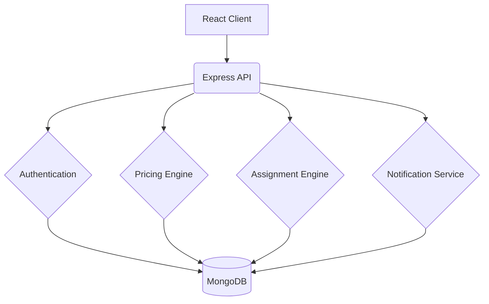

# Last-Mile Delivery Tracker


A full-stack MERN application for managing last-mile delivery operations with intelligent pricing, automatic delivery agent assignment, live order tracking, and customer notifications.

---

## Table of Contents
- [Project Overview](#-project-overview)
- [Key Features](#-key-features)
- [Tech Stack](#-tech-stack)
- [System Architecture](#-system-architecture)
- [Getting Started](#-getting-started)
- [Environment Variables](#-environment-variables)
- [System Workflow](#-system-workflow)
- [API Reference](#-api-reference)

---

## Project Overview

The **Last-Mile Delivery Tracker** is a logistics management platform that bridges the gap between customers, delivery agents, and system administrators. 
Built on a modular MERN architecture, the system automatically calculates delivery charges using configurable rate cards, intelligently assigns delivery agents based on geographical zones, tracks every delivery stage with an immutable timeline, and sends notifications to customers throughout the delivery lifecycle.

---

## Key Features

### Role-Based Access Control
* **Customer Portal**: Create delivery orders, view dynamic delivery charges, track live delivery status, and receive Email/SMS notifications.
* **Agent Dashboard**: View assigned deliveries, update tracking timelines, log current locations, and mark deliveries as complete or failed.
* **Admin Control Center**: Manage delivery zones, configure volumetric rate cards, manually override order assignments, and monitor platform-wide analytics.

### Intelligent Pricing Engine
* Calculates volumetric weight vs. actual billable weight automatically.
* Dynamically identifies Pickup & Drop zones to select the correct B2B/B2C rate card.
* Adds intelligent surcharges for Cash on Delivery (COD).

###Auto-Assignment Engine
* Matches pending orders to available delivery agents based on geographic zone availability.
* Fallbacks to manual Admin assignment during high-load periods.

### Immutable Tracking & Notifications
* Live order status timeline (Pending → Assigned → Picked Up → In Transit → Delivered).
* Every status update creates a permanent, immutable tracking record.

---

## Tech Stack

**Frontend:**
- React.js (v19)
- Vite (Build Tool)
- Tailwind CSS (v4) for minimalist, responsive design
- React Router DOM
- Axios

**Backend:**
- Node.js & Express.js
- MongoDB & Mongoose
- JSON Web Tokens (JWT) for Authentication
- bcrypt (Password Encryption)

---

## System Architecture



---

## Getting Started

Follow these instructions to set up the project locally.

### Prerequisites
- Node.js (v18 or higher)
- MongoDB Atlas Account (or local MongoDB server)
- Git

### Installation

1. **Clone the repository:**
   ```bash
   git clone https://github.com/anurrraggg/Last-Mile-Delivery-Tracker.git
   cd Last-Mile-Delivery-Tracker
   ```

2. **Setup Backend:**
   ```bash
   cd server
   npm install
   ```
   *Create a `.env` file in the `/server` directory using the variables listed below.*
   ```bash
   npm run dev
   ```

3. **Setup Frontend:**
   ```bash
   cd client
   npm install
   npm run dev
   ```

---

## Environment Variables

To run this project, you will need to add the following environment variables to your `server/.env` file:

```env
PORT=5000
MONGODB_URI=mongodb+srv://<your_db_username>:<your_db_password>@cluster0.xxxxx.mongodb.net/last-mile-tracker?retryWrites=true&w=majority
JWT_SECRET=your_super_secret_jwt_key
```

*(Note: The `.env` file is explicitly ignored in `.gitignore` to prevent sensitive credentials from being leaked).*

---

## Database Schema Overview

The system uses a highly relational MongoDB structure via Mongoose:
- `Users`: Stores Customers, Agents, and Admins.
- `Zones`: Defines geographic operational areas.
- `RateCards`: Pricing rules connecting Zones.
- `Orders`: The core entity containing package dimensions, pricing, and status.
- `TrackingHistory`: Immutable logs of every status change.

---

## API Reference

| Endpoint | Method | Description | Role |
|----------|--------|-------------|------|
| `/api/auth/login` | POST | Authenticate user & get JWT | Public |
| `/api/orders` | POST | Create a new delivery order | Customer |
| `/api/orders/:id` | GET | View order timeline | All |
| `/api/agents/location` | PATCH | Update agent GPS coordinates | Agent |
| `/api/admin/ratecards` | POST | Configure new pricing rules | Admin |
| `/api/admin/orders/:id/assign`| PATCH | Manually override agent assignment | Admin |

---
*Built for modern logistics.*
