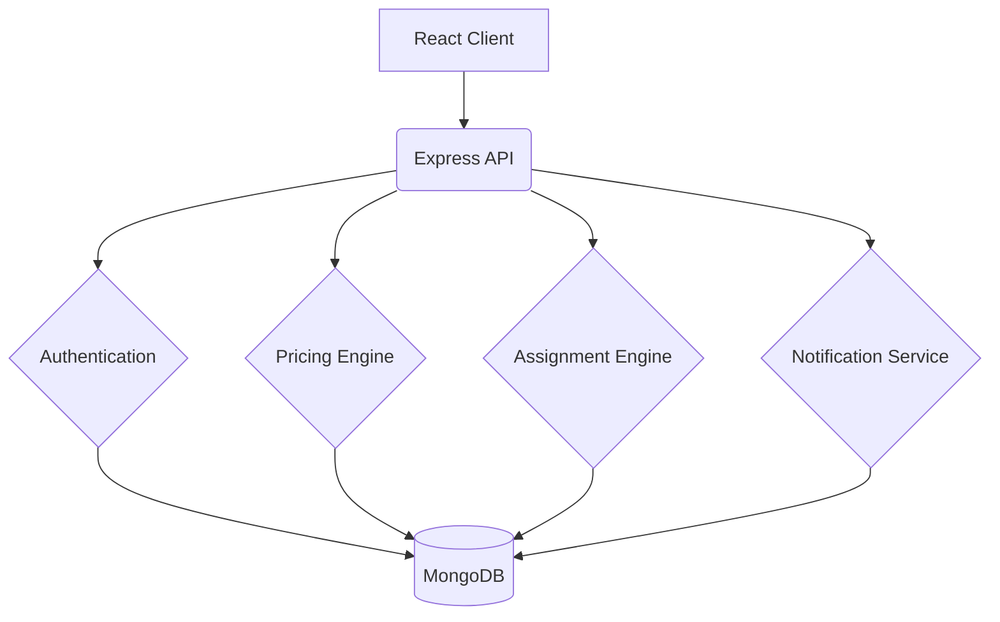

# Last-Mile Delivery Tracker

A full-stack MERN application built to manage last-mile delivery operations. It handles order creation, automatic pricing, agent assignment, live tracking, and customer notifications — all from a single platform.

---

## Overview

The system connects three types of users: customers who place orders, delivery agents who fulfill them, and admins who manage the overall operation. The backend is modular, with each core feature — pricing, assignment, tracking, notifications — handled by its own service.

---

## Features

**Customer**
- Place delivery orders with a live price estimate before confirming
- Track order status in real time
- Reschedule failed deliveries

**Delivery Agent**
- View assigned orders
- Update delivery status at each stage
- Log location and add remarks

**Admin**
- Manage delivery zones and rate cards
- Manually assign or reassign orders
- View platform-wide order and agent analytics

---

## Tech Stack

**Frontend:** React 19, Vite, Tailwind CSS v4, React Router DOM, Axios

**Backend:** Node.js, Express.js, MongoDB, Mongoose, JWT, bcryptjs

---

## System Architecture



---

## Getting Started

**Prerequisites**
- Node.js v18+
- MongoDB (Atlas or local)
- Git

**1. Clone the repository**
```bash
git clone https://github.com/anurrraggg/Last-Mile-Delivery-Tracker.git
cd Last-Mile-Delivery-Tracker
```

**2. Setup the backend**
```bash
cd server
npm install
```
Create a `.env` file inside the `server/` directory (see Environment Variables below), then run:
```bash
npm run dev
```

**3. Setup the frontend**
```bash
cd client
npm install
npm run dev
```

---

## Environment Variables

Create a `server/.env` file with the following variables:

```env
PORT=5000
MONGO_URI=mongodb+srv://<username>:<password>@cluster0.xxxxx.mongodb.net/last-mile-tracker?retryWrites=true&w=majority
JWT_SECRET=your_jwt_secret_key
```

The `.env` file is listed in `.gitignore` and will never be committed to the repository.

---

## Database Collections

- **Users** — stores all customers, agents, and admins with hashed passwords
- **Zones** — defines geographic operational areas used for matching
- **RateCards** — admin-configured pricing rules between zone pairs
- **Orders** — the core entity, holds package details, pricing, status, and agent assignment
- **TrackingHistory** — immutable log of every status change on an order
- **Notifications** — alerts sent to customers on key status changes

---

## API Reference

| Endpoint | Method | Description | Role |
|---|---|---|---|
| `/api/auth/register` | POST | Register a new user | Public |
| `/api/auth/login` | POST | Login and receive a JWT | Public |
| `/api/orders/estimate` | POST | Get delivery charge estimate | Customer |
| `/api/orders` | POST | Place a new order | Customer |
| `/api/orders/:id` | GET | Get order details and timeline | All |
| `/api/orders/:id/reschedule` | PATCH | Reschedule a failed delivery | Customer |
| `/api/agent/orders` | GET | Get assigned orders | Agent |
| `/api/agent/orders/:id` | PATCH | Update order status | Agent |
| `/api/admin/zones` | GET / POST | Manage delivery zones | Admin |
| `/api/admin/ratecards` | GET / POST | Manage pricing rules | Admin |
| `/api/admin/orders/:id/assign` | PATCH | Manually assign an agent | Admin |

---

## System Design

### Rate Calculation and Zone Detection

When an order is placed, the system first detects which zone the pickup and drop addresses fall into by matching them against stored zone records. Once both zones are identified, the pricing engine calculates volumetric weight using the formula `(L x B x H) / 5000` and compares it against the actual weight, billing for whichever is higher.

It then finds the matching rate card for that zone pair and order type (B2C or B2B), multiplies the billable weight by the applicable rate, and adds a COD surcharge if the payment method is cash on delivery. This calculated price is shown to the customer before they confirm the order.

### Auto-Assignment

When an order is confirmed, the assignment engine looks for delivery agents who are marked as available and assigned to the same zone as the pickup address. If a match is found, the order is assigned to that agent automatically and the agent gets a notification. If no agent is available, the order stays in a pending state and an admin can assign it manually from the control panel.

### Failed Delivery and Rescheduling

If a delivery attempt fails, the agent marks the order as failed and adds a remark explaining the reason. The customer is notified and can log in to reschedule for a later date. On rescheduling, the system puts the order back into the assignment flow, either auto-assigning an available agent or queuing it for admin review.

Every status change across the entire order lifecycle — from creation to final delivery or failure — is recorded in the TrackingHistory collection with a timestamp and the actor who triggered it. This log is immutable and cannot be modified after the fact.
